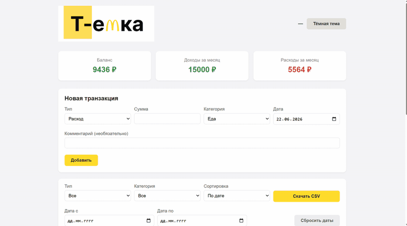
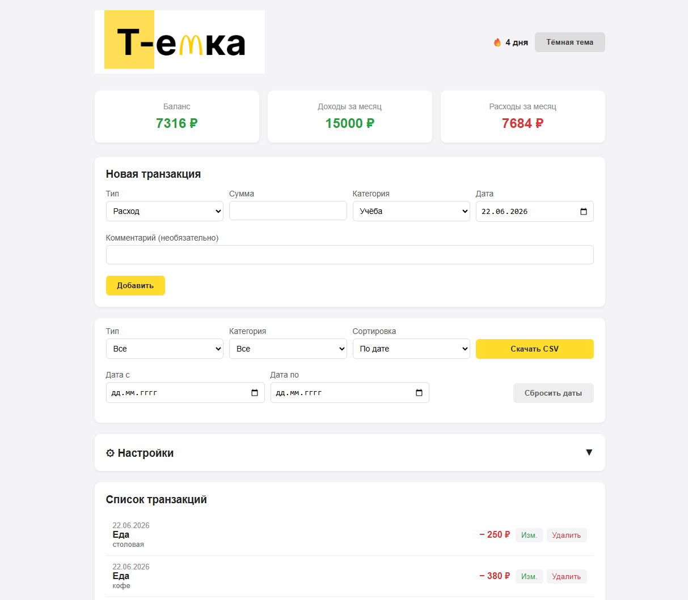
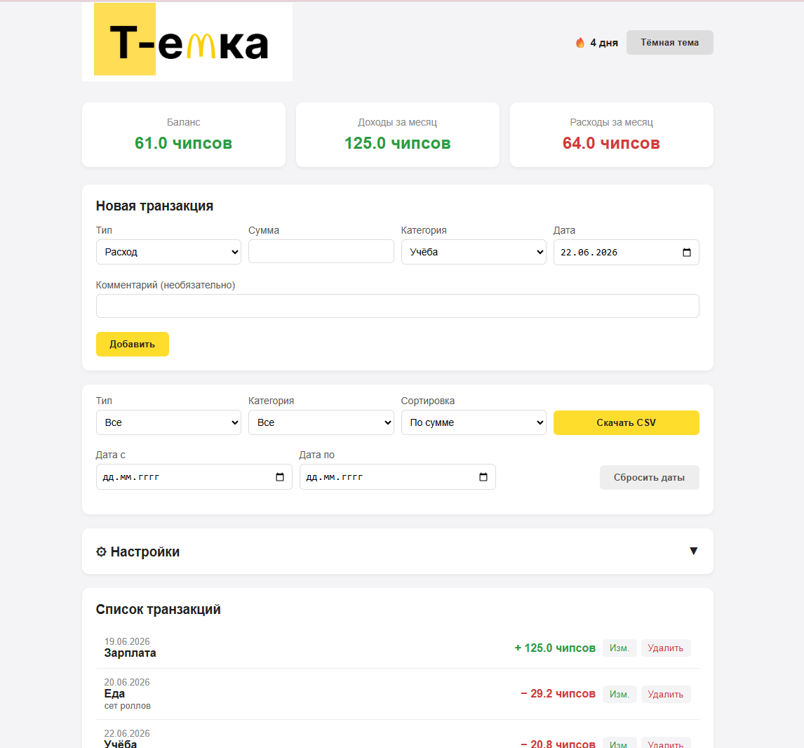
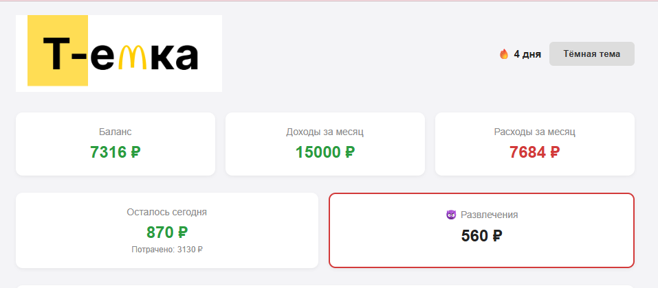

# Т-емка — личный трекер финансов 💰

> Веб-приложение для учёта личных доходов и расходов. **Java REST API** на чистом JDK (без фреймворков) + лёгкий фронтенд на ванильном JavaScript.

🥇 **1 место** · хакатон Т-Образования и СНО «from VMK»



---

## 📸 Скриншоты

| Общий вид | Своя валюта | Лимит и «слабое место» |
|---|---|---|
|  |  |  |

## Стек

| Слой | Технологии |
|---|---|
| **Backend** | Java (`com.sun.net.httpserver`) — REST API без внешних фреймворков и зависимостей |
| **Хранилище** | Серверная персистентность транзакций в JSON-файл, потокобезопасный доступ (`synchronized`) |
| **Frontend** | Чистый HTML + CSS + JavaScript (ванильный), общение с API через `fetch` |
| **Настройки клиента** | `localStorage` — валюта, дневной лимит, тема, пользовательские категории |
| **Сборка/запуск** | `javac` / `java` (JDK 17+), без Maven/Gradle |

Бэкенд написан на голом JDK: HTTP-сервер, маршрутизация, ручная JSON-сериализация и парсинг, потокобезопасное файловое хранилище — всё без сторонних библиотек.

## REST API

Базовый ресурс — `/api/transactions`, формат — JSON.

| Метод | Путь | Описание | Ответ |
|---|---|---|---|
| `GET` | `/api/transactions` | Список всех транзакций | `200` |
| `POST` | `/api/transactions` | Создать транзакцию | `201` |
| `PUT` | `/api/transactions/{id}` | Обновить транзакцию | `200` / `404` |
| `DELETE` | `/api/transactions/{id}` | Удалить транзакцию | `204` / `404` |

Транзакция: `{ id, type, amount, category, date, comment }`. Данные сохраняются на сервере в `data/transactions.json` и переживают перезапуск.

## Функционал

| Возможность | Описание |
|---|---|
| Добавление транзакций | Тип (доход/расход), сумма, категория, дата, комментарий |
| Редактирование и удаление | Правка любой записи прямо из списка |
| Статистика | Текущий баланс, доходы и расходы за текущий месяц |
| Фильтры | По типу, категории, диапазону дат |
| Сортировка | По дате, сумме или категории |
| Экспорт | Выгрузка всех транзакций в CSV (с BOM для корректного открытия в Excel) |
| Тёмная тема | Переключение светлой/тёмной темы с сохранением предпочтения |
| Адаптивный дизайн | Корректное отображение на мобильных устройствах |

## Авторские фичи команды

### 1. Своя система исчисления валюты
Устали считать в рублях? Задайте собственную единицу — например, **«шаурма»** (400 ₽) или **«чашка кофе»** (120 ₽). Все суммы во всём интерфейсе автоматически пересчитываются.

```
Настройки → Своя валюта: "шаурма", курс: 400
→ 4 000 ₽ отобразятся как "10.0 шаурма"
```

### 2. Дневной лимит расходов
Установите максимально допустимую сумму трат в день. На главной появляется карточка **«Осталось сегодня»** — зелёная, пока деньги есть, красная, когда бюджет исчерпан.

### 3. Счётчик ударных дней (streak)
В шапке показывается 🔥, сколько дней **подряд** вы добавляли хотя бы одну транзакцию. Мотивирует не прерывать привычку следить за финансами.

### 4. «Слабое место» — категория под особым контролем
Закрепите одну категорию расходов как проблемную (например, «Развлечения» или «Доставка еды»):
- в шапке появляется отдельная карточка с суммой всех трат по этой категории;
- соответствующие записи подсвечиваются красным фоном с меткой 😈;
- при добавлении новой траты в «слабую» категорию приложение показывает предупреждение.

### 5. Пользовательские категории
Базовый набор категорий можно расширить — добавить свои, отдельно для расходов и доходов, и удалить ненужные.

## Быстрый старт

Требуется JDK 17+.

```bash
javac -d out src/Server.java
java -cp out Server
# Открыть http://localhost:3000
```

## Структура проекта

```
├── index.html      — разметка и структура страницы
├── style.css       — стили, тёмная тема, адаптив
├── script.js       — фронтенд-логика: fetch к API, фильтры, настройки, streak
├── src/Server.java — Java REST API + файловое хранилище
└── data/           — transactions.json (создаётся при первом запуске)
```

## Команда

| | Имя | Роль |
|---|---|---|
| 👩‍💻 | **Кристина** | Backend (Java REST API), хранилище данных |
| 👩‍💻 | **Соня** | Frontend, UI-дизайн |

## 🏆 Награды

🥇 **1 место** на хакатоне Т-Образования и СНО «from VMK».

📄 [Диплом и материалы проекта (Google Drive)](https://drive.google.com/drive/folders/1Cibu945R4khoygMZWVm3nfCsKnV0vaJj?usp=sharing)
